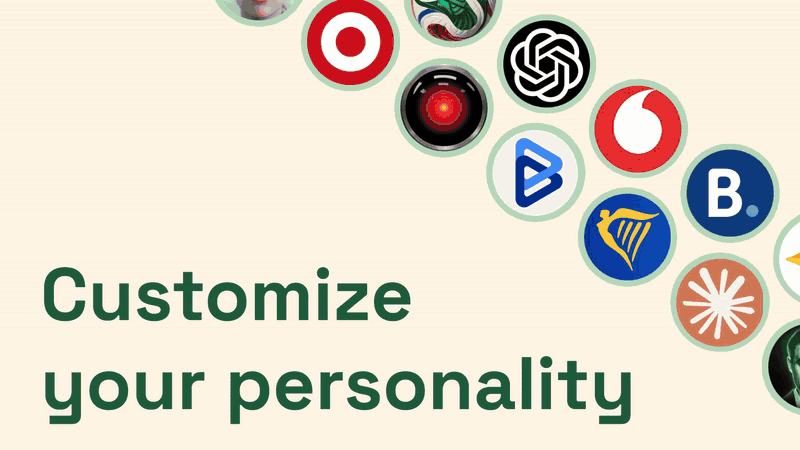

# silOS

**A self-hosted, security-first AI assistant that lives on your server and talks to you on Telegram.**

<p align="center">
  
</p>

You message a Telegram bot from your phone. Behind it, a persistent Claude session (the *core*) runs on your own server. It remembers things in a markdown knowledge graph (the *vault*), hands specialist work to *agents*, and reaches outside services through *roots* such as Gmail and GitHub. You only ever see a chat.

silOS is a framework, not an app. Think of it as the OS: it provides the runtime, memory, scheduling and isolation, and agents are the apps that run on it.

```
You (phone)
   │  Telegram
   ▼
bot  ──────────►  core (persistent Claude session)
                    ├── vault/   persistent memory: linked markdown notes + SQLite index
                    ├── agents/  specialist sub-sessions (email, github, routines, …)
                    └── roots/   integrations (Gmail, GitHub, …) — credentials stay here
```

## Features

- **Persistent memory.** Notes are Obsidian-style markdown with frontmatter, `[[wikilinks]]`, backlinks and aliases. A SQLite index supports full-text search, alias resolution, PageRank and spreading activation (`vault activate "…"`).
- **Session continuity.** `/save`, `/compact` and `/restart` write conversation summaries, and the next session reads the most recent ones at startup.
- **Agents.** Each agent is a folder with a `SKILL.md` that is auto-registered at startup. Each agent can write only to its own memory namespace.
- **Roots.** Integrations are thin CLIs with a `manifest.yaml`. Gmail and GitHub are included.
- **Routines.** Scheduled prompts, either one-shot or cron, that fire on their own and message you ("every weekday at 8, summarize my unread email").
- **Telegram niceties.** Voice notes are transcribed locally with whisper.cpp. You can send photos and PDFs, the bot can send files and map pins back to you, and `/model` and `/effort` switch the model live.
- **Optional memory viewer.** A Telegram Mini App that draws your vault as a graph. It only sees titles and links, never note contents.

## Security model

The *silo* in silOS is the point.

- **Single user.** The bot drops every message that isn't from your Telegram username.
- **Locked-down containers.** Every container has a read-only root filesystem, `no-new-privileges` and resource limits. Each container gets only the mounts it needs.
- **The bot can't write your memory.** It mounts the vault read-only.
- **Credentials stay out of the model's reach.** Root credentials live in `roots/*/.env`, are mounted read-only, and are git-ignored and docker-ignored.
- **The viewer is isolated.** It is the only internet-facing service, sits on its own network with no route to the core or the internet, and only ever sees a structure-only graph snapshot.
- **Your data stays out of git.** The repo ships an **empty vault**, and personal notes, conversation summaries, agent memories and assets are git-ignored.

## Requirements

- A Linux server (Ubuntu 24.04 recommended), 2 GB RAM, Docker with Compose v2
- A Telegram account and a bot token from [@BotFather](https://t.me/BotFather)
- A Claude account that can sign in to [Claude Code](https://docs.claude.com/en/docs/claude-code) (Pro/Max subscription or Console account)

## Quick start

```bash
git clone https://github.com/apopov04/silOS-release.git silos
cd silos
./scripts/setup.sh            # creates .env, empty root configs and runtime dirs
nano .env                     # bot token, your Telegram username, timezone
docker compose build
docker compose run --rm -it core claude   # sign in to Claude once, then type /exit
docker compose up -d
```

Now open your bot in Telegram and say hi.

**Full step-by-step guide** (server hardening, Gmail/GitHub, the viewer, the status command, troubleshooting): **[docs/SETUP.md](docs/SETUP.md)**

## Telegram commands

- `/session`: model, effort and session info
- `/model [id]`: show or switch the model
- `/effort [low|medium|high|max]`: show or set reasoning effort
- `/routines`: list, toggle and delete scheduled routines
- `/save`: write a conversation summary to the vault
- `/compact`: save, then start a fresh, compacted session
- `/restart`: save and restart the session
- `/status`: server health (needs the optional admin service)

## Making it yours

- **Personality and rules.** Edit `vault/startup/standing-orders.md`. Everything in `vault/startup/` is loaded into every session.
- **Memory conventions.** See `vault/startup/vault-instructions.md` and `vault/agents/_rules.md`.
- **Add an agent.** Create `vault/agents/<name>/SKILL.md` with frontmatter (`name`, `description`, `requires: [roots]`, `tools`) and instructions, plus an empty `memory/` folder. It shows up after `/restart`. See [docs/EXTENDING.md](docs/EXTENDING.md).
- **Add a root.** Create `roots/<name>/` with a `cli.js` and a `manifest.yaml`, then rebuild the core.

## Repository layout

```
src/          core server, Telegram bot, vault indexer + CLI, scheduler, helper CLIs
roots/        integrations (gmail, github, echo example)
vault/        empty memory vault: startup instructions + bundled agents
viewer/       optional Telegram Mini App graph viewer
docker/       Dockerfiles for bot, core, viewer
scripts/      setup helpers
docs/         setup and extension guides
CLAUDE.md     design document / architecture notes
```

## Status

**v1.0.0 is the first official release**, the result of several months of work. silOS is built for one user per server.

**No further updates are planned for now.** The project is feature-complete for its original goal and is published as-is. Issues and forks are welcome, but don't expect active maintenance.

## License

silOS is fully open source under the [MIT License](LICENSE). Use it, fork it, change it, ship it.
